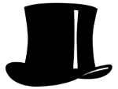
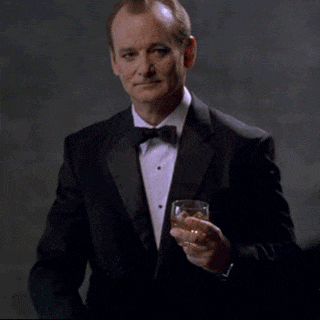

#addSomeClass

A little jQuery plugin that adds some class when you `.addClass()`.

##How to use it

Just add addSomeClass after you bring in jQuery, like this:

```<script src="path/to/addSomeClass.js"></script>```

Then, `.addClass` with jQuery like you normally would, and voila: A much classier website, complete with top hats.



It will also replace any images you have added class to, and make it something classier: Bill Murray in a tuxedo.



You don't even need the image folder - the .pngs are 64 bit encoded and the gif hotlinks to giphy. But they're there if you want it.

##Options

addSomeClass also has a suite of options you can use to personalize how classy you want your website. Just enter them in an object when you call the method.

Parameter | Type | Default | Description
--- | --- | --- | ---
`hat` | string | `top hat` | Defines what type of hat you want. Currently supports `tophat` and `bowler`
`monocle`| boolean | `false` | Adds a monocle to the overlay of the 'classy' object.
`bowtie`| boolean | `false` | Adds a bowtie to the 'classy' object.
`mustache`| boolean | `false` | Adds a mustache to the 'classy' object.
`fanciest`| boolean | `false` | Adds a monocle, mustache, and bowtie to the 'classy' object. Overrides the previous 3 options.
`xPos` | number | `50` | The horizontal position of the hat (as a percentage).
`hatSize` | number | `100` | How large you want the accessories to be. Based off an index of 100.
`imagereplace` | boolean | `true` | Whether you want to replace images or not.
`image` | string | `images/murray-classy-point.gif` | The image you want to replace other images with.


###A sample

```javascript
$('Something to Class Up').addClass('A class to add', {
	hat: 'bowler',
	fanciest: true
})
```

##More examples

Check out [my site](http://www.mattfairley.com/addSomeClass/) for an example of addSomeClass in the wild.

##License

This library is released under the MIT license.